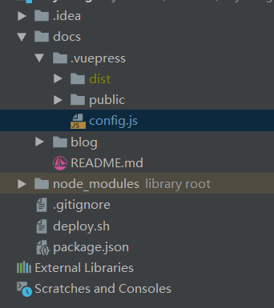

# 概述
VuePress是一个以Vue驱动的静态网站生成器，是一个由Vue、Vue Router和webpack驱动的单页应用。主要通过config.js来配置导航栏、侧边栏、页面导航、应用插件等。

### 最大特点
在VuePress中，可以使用Markdown编写文档，然后生成网页。其中根目录的README.md就是网页的主页。

### 运行原理
运行原理(how it works)VuePress网站实际上是由Vue, Vue Router和webpack驱动的单页面应用程序。每个markdown文件都使用`markdown-it`编译为 HTML，然后作为 Vue 组件的模板进行处理。

## 起步
完成后的项目结构为：

<div align="center">
  
</div>

1. 新建一个名为`blog-demo`的文件夹，命令行进入到该文件夹目录，输入命令：

```
# 按默认配置初始化一个项目，此时会在当前目录下生成 package.json 文件
npm init -y
```

2. 将VuePress作为一个本地依赖安装

```
npm install -D vuepress
```

3.在`package.json` 里的scripts中添加如下代码，不需要修改其它代码

``` js{4}
{
  "scripts": {
    "docs:dev": "vuepress dev docs",
    "docs:build": "vuepress build docs"
  }
}
```

4. 在项目根目录下，新建`docs`文件夹

```
mkdir docs
```

5. 新建一个markdown文件

```
echo '# Hello VuePress!' > docs/README.md
```

6. 输入命令启动项目，在浏览器中访问`http://localhost:8080/`即可预览效果

```
npm run docs:dev
```

此时,因为并没有在创建`README.md`,也没有在`config.js`中配置任何东西，所以近乎是一个空白页。


<div align="center">

</div>


为了更好地自定义我们的网站，接着在docs目录下新建`.vuepress`文件夹，执行命令如下：

7. 新建`.vuepress`和`README.md`文件夹

```
mkdir docs\.vuepress
```

8. 配置首页
默认主题提供了一个首页的布局，在根级`README.md`以格式 YAML front matter 指定 home: true即可使用它。

```
---
home: true
heroImage: /vue-logo.png
heroText: blog-demo
tagline: 博客示例
actionText: 快速上手 →
actionLink: /blog/FirstBlog.md
features:
- title: 简洁至上
  details: 以 Markdown 为中心的项目结构，以最少的配置帮助你专注于写作。
- title: Vue驱动
  details: 享受 Vue + webpack 的开发体验，在 Markdown 中使用 Vue 组件，同时可以使用 Vue 来开发自定义主题。
- title: 高性能
  details: VuePress 为每个页面预渲染生成静态的 HTML，同时在页面被加载的时候，将作为 SPA 运行。
---
```

::: tip 配置项含义：
- heroImage: 首页图片，图片放置在.vupress/public文件夹下，若没有该文件夹则自己创建一个，保存一张你想要的首页图片，并在此处引用。
- actionText:首页中间的一个按钮
- actionLink:上面按钮的路由导航
:::

运行后效果：

<div align="center">
  
</div>

9. 接着在.vuepress文件夹下新建config.js文件，在其中添加如下代码：

```JS{4}
module.exports = {
  base: '/blog-demo/',
  title: 'blog-demo',
  description: 'Vuepress blog demo'
}
```

::: tip 配置项含义：
- base：站点的基础路径，它的值应当总是以斜杠开始，并以斜杠结束。这里设置为 /blog-demo/ ，我们再次在本地运行项目，访问路径就需要变更为 http://localhost:8080/blog-demo/
- title：网站的标题
- description：网站的描述
:::

10. 导航栏和侧边栏
导航栏可能包含你的页面标题、搜索框、 导航栏链接、多语言切换、仓库链接，它们均取决于你的配置。在`.vupress/config.js`文件添加一些导航栏链接：

```JS{4}
module.exports = {
    themeConfig: {
        // 你的GitHub仓库，请正确填写
        repo: 'https://github.com/xxxxxxx/blog-demo',
        // 自定义仓库链接文字。
        repoLabel: 'My GitHub',
        nav: [
            { text: 'Home', link: '/' },
            { text: 'FirstBlog', link: '/blog/FirstBlog.md' }
        ]
    }
}
```

侧边栏配置：

```JS{4}
module.exports = {
  themeConfig: {
    sidebar: [
      ['/', '首页'],
      ['/blog/FirstBlog.md', '我的第一篇博客']
    ]
  }
}
```

侧边栏组：
```js{4}
{
                title: 'group1',
                collapsable: false,
                children: [
                    ['/', 'title1'],
                    ['/', 'title2']
                ]
            },
            {
                title: 'group2',
                collapsable: false,
                children: [
                    ['/', 'title1'],
                ]
            }
```

其中`collapsable: false`可以强制侧边栏组不能折叠。

11. 在docs目录下新建blog文件夹,在blog目录下创建 `/blog/FirstBlog.md`作为我们第一篇博客的内容：

```
# 我的第一篇博客
My First Blog
```

因为在README.md中配置的actionLink为`FirstBlog.md`，所以点击快速上手按钮以后的网页为：

<div align="center">
  
</div>


## 部署

将代码部署到GitHub Pages。

1. 在根目录的 package.json文件中增加如下两段代码：

```JS{4}
// 配置npm scripts
"scripts": {
    "docs:dev": "vuepress dev docs",
    "docs:build": "vuepress build docs"
 }

// VuePress 以本地依赖的形式被安装
"devDependencies": {
    "vuepress": "^0.14.8"
}
```

2. 在github上创建一个名为 blog-demo 的仓库，并将你的代码提交到github上。

3. 在`config.js`中设置base。

如果打算发布到`https://<USERNAME>.github.io/<REPO>/`（也就是说你的仓库在`https://github.com/<USERNAME>/<REPO>`），
则将base设置为 `/<REPO>/`，此处我设置为 `/blog-demo/` 。

4. 在项目根目录中，创建一个如下的 deploy.sh 脚本文件。

```
#!/usr/bin/env sh

# 确保脚本抛出遇到的错误
set -e

# 生成静态文件
npm run docs:build

# 进入生成的文件夹
cd docs/.vuepress/dist

git init
git add -A
git commit -m 'deploy'

# 如果发布到 https://<USERNAME>.github.io/<REPO>
git push -f git@github.com:<USERNAME>/<REPO>.git master:gh-pages

cd -
```

5. 运行deploy.sh脚本，会自动在我们的 GitHub 仓库中，创建一个名为 gh-pages 的分支。

6. 这是最后一步了，在 GitHub 项目点击 Setting 按钮，找到 GitHub Pages - Source，选择 gh-pages 分支,等待一段时间后即可部署完成。

<div align="center">
  
</div>

::: tip 注意事项：
1. 图片要放在指定的public目录下，否则.vuepress/config.js中的引用的图片加载不出来。
2. base问题：如果你打算用`https://<仓库名>.github.io/`来访问的话，base可以省略不写。
:::

::: warning 关于deploy.sh
1. deploy.sh的运行方法为cd到所在目录，然后选中deploy.sh回车。
2. 在运行deploy.sh脚本时因为各种问题可能会运行不成功，这时不要死命运行，可以手动执行脚本，看看是哪里出现了问题。
在blog-demo目录下，依次运行以下命令。

```
npm run docs:build
cd docs/.vuepress/dist
git init
git add -A
git commit -m 'deploy'
# 如果发布到 https://<USERNAME>.github.io/<REPO>
git push -f git@github.com:<USERNAME>/<REPO>.git master:gh-pages
```
3. 运行deploy.sh脚本需要在github上配置ssh秘钥，如果没有配置将会出现构建一段时间后，在最后时刻闪退的问题。
:::
